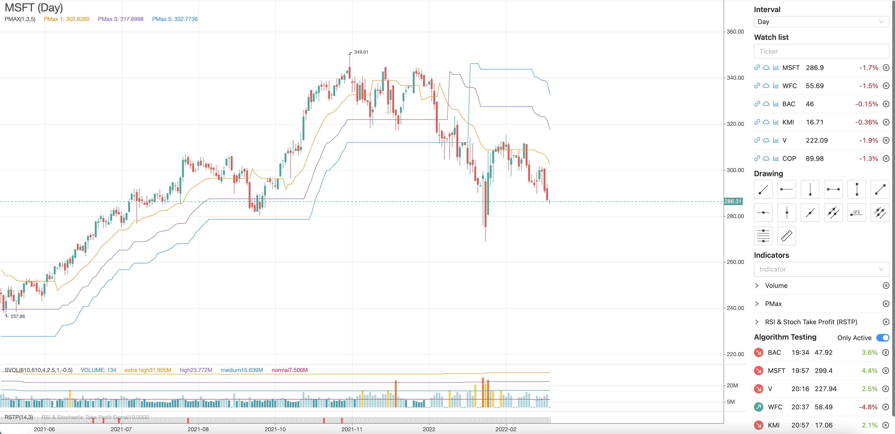

# Technical Analysis 

Terminal that gives you an ability to check your algorithm or a strategy.

#### Supported API
* Tinkoff
* Binance (WIP)

### Algorithm Testing
With this functionality you can easily test your strategy. Just change the algoritm here backend/src/modules/algorithmTesting/algorithms/index.ts Also you can add notifications there if you need this.

### How to run
You have to install python, poetry, node.js

1) cd frontend && npm i && npm run start
2) create .env in the /backend folder with TINKOFF_SECRET=your_secret_key
3) cd backend && npm i && npm run start:dev
4) cd backend/indicators && poetry install && poetry run python main.py

If you want to create an algotrading bot or test your strategy I can help with this. Just send me an email :) aiduryagih@gmail.com
